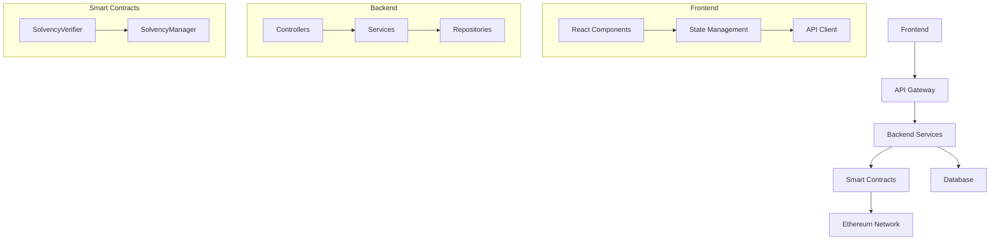

# Arquitetura do Sistema - Ibelieve Finance

## 1. Visão Geral

O Ibelieve Finance é um sistema distribuído que utiliza uma arquitetura em camadas para verificação de solvência usando provas criptográficas. O sistema é composto por três componentes principais:

1. **Frontend**: Interface web responsiva construída com React
2. **Backend**: API RESTful construída com Node.js
3. **Smart Contracts**: Contratos Ethereum para verificação de provas

## 2. Diagrama de Arquitetura



## 3. Componentes

### 3.1 Frontend

#### Tecnologias
- React 18
- TypeScript
- Material-UI
- Web3.js
- Redux Toolkit
- React Query

#### Estrutura
```
frontend/
├── src/
│   ├── components/     # Componentes reutilizáveis
│   ├── pages/         # Páginas da aplicação
│   ├── services/      # Serviços de API
│   ├── hooks/         # Custom hooks
│   ├── utils/         # Funções utilitárias
│   ├── types/         # Definições de tipos
│   └── store/         # Gerenciamento de estado
```

#### Fluxo de Dados
```typescript
// src/services/proof.service.ts
export class ProofService {
    async generateProof(data: ProofData): Promise<Proof> {
        const response = await api.post('/proofs', data);
        return response.data;
    }

    async verifyProof(proofId: string): Promise<VerificationResult> {
        const response = await api.post(`/proofs/${proofId}/verify`);
        return response.data;
    }
}
```

### 3.2 Backend

#### Tecnologias
- Node.js
- Express
- TypeScript
- PostgreSQL
- Redis
- TypeORM
- JWT

#### Estrutura
```
backend/
├── src/
│   ├── config/        # Configurações
│   ├── controllers/   # Controladores
│   ├── middlewares/   # Middlewares
│   ├── models/        # Modelos
│   ├── services/      # Serviços
│   ├── utils/         # Utilitários
│   └── routes/        # Rotas
```

#### Padrões de Design
```typescript
// src/services/proof.service.ts
@injectable()
export class ProofService {
    constructor(
        @inject('ProofRepository') private proofRepository: IProofRepository,
        @inject('Web3Service') private web3Service: IWeb3Service,
        @inject('CacheService') private cacheService: ICacheService
    ) {}

    async createProof(data: CreateProofDTO): Promise<Proof> {
        // Validação
        await this.validateProof(data);

        // Persistência
        const proof = await this.proofRepository.create(data);

        // Cache
        await this.cacheService.set(`proof:${proof.id}`, proof);

        // Blockchain
        await this.web3Service.submitProof(proof.proofHash);

        return proof;
    }
}
```

### 3.3 Smart Contracts

#### Tecnologias
- Solidity
- Hardhat
- OpenZeppelin
- Web3.js

#### Estrutura
```
contracts/
├── core/              # Contratos principais
├── interfaces/        # Interfaces
├── libraries/         # Bibliotecas
└── test/             # Testes
```

#### Padrões de Design
```solidity
// contracts/core/SolvencyVerifier.sol
contract SolvencyVerifier {
    struct Proof {
        bytes32 proofHash;
        uint256 balance;
        uint256 timestamp;
        bool verified;
    }

    mapping(bytes32 => Proof) public proofs;
    
    event ProofVerified(bytes32 indexed proofHash, uint256 balance);
    event ProofRejected(bytes32 indexed proofHash, string reason);

    function verifyProof(
        bytes32 proofHash,
        uint256 balance,
        uint256 timestamp,
        bytes calldata signature
    ) external returns (bool) {
        require(!proofs[proofHash].verified, "Proof already verified");
        
        if (verifySignature(proofHash, signature)) {
            proofs[proofHash] = Proof(proofHash, balance, timestamp, true);
            emit ProofVerified(proofHash, balance);
            return true;
        }
        
        emit ProofRejected(proofHash, "Invalid signature");
        return false;
    }
}
```

## 4. Comunicação entre Componentes

### 4.1 API REST

```typescript
// Rotas principais
POST /api/proofs           // Criar prova
GET /api/proofs/:id        // Obter prova
POST /api/proofs/:id/verify // Verificar prova
GET /api/proofs            // Listar provas
```

### 4.2 Web3

```typescript
// Interação com Smart Contracts
const contract = new web3.eth.Contract(
    SolvencyVerifier.abi,
    SolvencyVerifier.address
);

await contract.methods.verifyProof(
    proofHash,
    balance,
    timestamp,
    signature
).send({ from: account });
```

## 5. Persistência de Dados

### 5.1 Database Schema

```sql
CREATE TABLE proofs (
    id UUID PRIMARY KEY,
    proof_hash VARCHAR(66) NOT NULL,
    balance DECIMAL(20,8) NOT NULL,
    timestamp TIMESTAMP NOT NULL,
    status VARCHAR(20) NOT NULL,
    created_at TIMESTAMP DEFAULT CURRENT_TIMESTAMP,
    updated_at TIMESTAMP DEFAULT CURRENT_TIMESTAMP
);

CREATE TABLE users (
    id UUID PRIMARY KEY,
    name VARCHAR(255) NOT NULL,
    email VARCHAR(255) UNIQUE NOT NULL,
    password_hash VARCHAR(255) NOT NULL,
    role VARCHAR(20) NOT NULL,
    created_at TIMESTAMP DEFAULT CURRENT_TIMESTAMP
);
```

### 5.2 Caching

```typescript
// src/services/cache.service.ts
@injectable()
export class CacheService {
    constructor(
        @inject('Redis') private redis: Redis
    ) {}

    async get<T>(key: string): Promise<T | null> {
        const data = await this.redis.get(key);
        return data ? JSON.parse(data) : null;
    }

    async set(key: string, value: any, ttl?: number): Promise<void> {
        await this.redis.set(
            key,
            JSON.stringify(value),
            ttl ? 'EX' : undefined,
            ttl
        );
    }
}
```

## 6. Escalabilidade

### 6.1 Load Balancing

```nginx
# nginx.conf
upstream backend {
    server backend1:4000;
    server backend2:4000;
    server backend3:4000;
}

server {
    listen 80;
    server_name api.ibeleve.com;

    location / {
        proxy_pass http://backend;
        proxy_set_header Host $host;
        proxy_set_header X-Real-IP $remote_addr;
    }
}
```

### 6.2 Caching

```typescript
// src/middlewares/cache.middleware.ts
export const cacheMiddleware = (ttl: number) => {
    return async (req: Request, res: Response, next: NextFunction) => {
        const key = `cache:${req.originalUrl}`;
        const cached = await cacheService.get(key);

        if (cached) {
            return res.json(cached);
        }

        res.sendResponse = res.json;
        res.json = (body: any) => {
            cacheService.set(key, body, ttl);
            return res.sendResponse(body);
        };

        next();
    };
};
```

## 7. Monitoramento

### 7.1 Logging

```typescript
// src/utils/logger.ts
export const logger = winston.createLogger({
    level: 'info',
    format: winston.format.json(),
    transports: [
        new winston.transports.File({ filename: 'error.log', level: 'error' }),
        new winston.transports.File({ filename: 'combined.log' })
    ]
});
```

### 7.2 Métricas

```typescript
// src/middlewares/metrics.middleware.ts
export const metricsMiddleware = (req: Request, res: Response, next: NextFunction) => {
    const start = Date.now();

    res.on('finish', () => {
        const duration = Date.now() - start;
        metrics.recordApiCall(req.path, res.statusCode, duration);
    });

    next();
};
```

## 8. Segurança

### 8.1 Autenticação

```typescript
// src/middlewares/auth.middleware.ts
export const authMiddleware = async (req: Request, res: Response, next: NextFunction) => {
    try {
        const token = req.headers.authorization?.split(' ')[1];
        if (!token) {
            throw new Error('Token não fornecido');
        }

        const decoded = jwt.verify(token, process.env.JWT_SECRET!);
        req.user = decoded;
        next();
    } catch (error) {
        res.status(401).json({ error: 'Não autorizado' });
    }
};
```

### 8.2 Rate Limiting

```typescript
// src/middlewares/rate-limit.middleware.ts
export const rateLimiter = rateLimit({
    windowMs: 15 * 60 * 1000, // 15 minutos
    max: 100, // limite de 100 requisições por IP
    message: 'Muitas requisições deste IP, tente novamente mais tarde'
});
```

## 9. Deployment

### 9.1 Docker

```dockerfile
# Dockerfile
FROM node:18-alpine

WORKDIR /app

COPY package*.json ./
RUN npm install

COPY . .
RUN npm run build

EXPOSE 4000

CMD ["npm", "start"]
```

### 9.2 Kubernetes

```yaml
# deployment.yaml
apiVersion: apps/v1
kind: Deployment
metadata:
  name: ibeleve-backend
spec:
  replicas: 3
  selector:
    matchLabels:
      app: ibeleve-backend
  template:
    metadata:
      labels:
        app: ibeleve-backend
    spec:
      containers:
      - name: backend
        image: ibeleve/backend:latest
        ports:
        - containerPort: 4000
        env:
        - name: NODE_ENV
          value: "production"
```

## 10. Referências

- [React Documentation](https://reactjs.org/docs)
- [Node.js Documentation](https://nodejs.org/docs)
- [Solidity Documentation](https://docs.soliditylang.org)
- [Ethereum Development](https://ethereum.org/developers) 