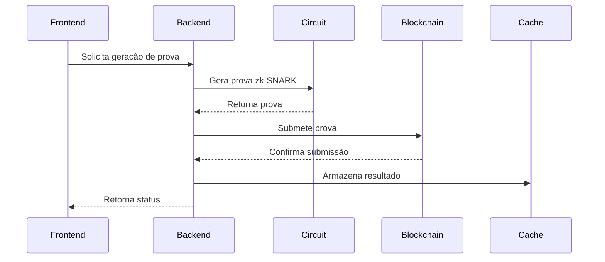
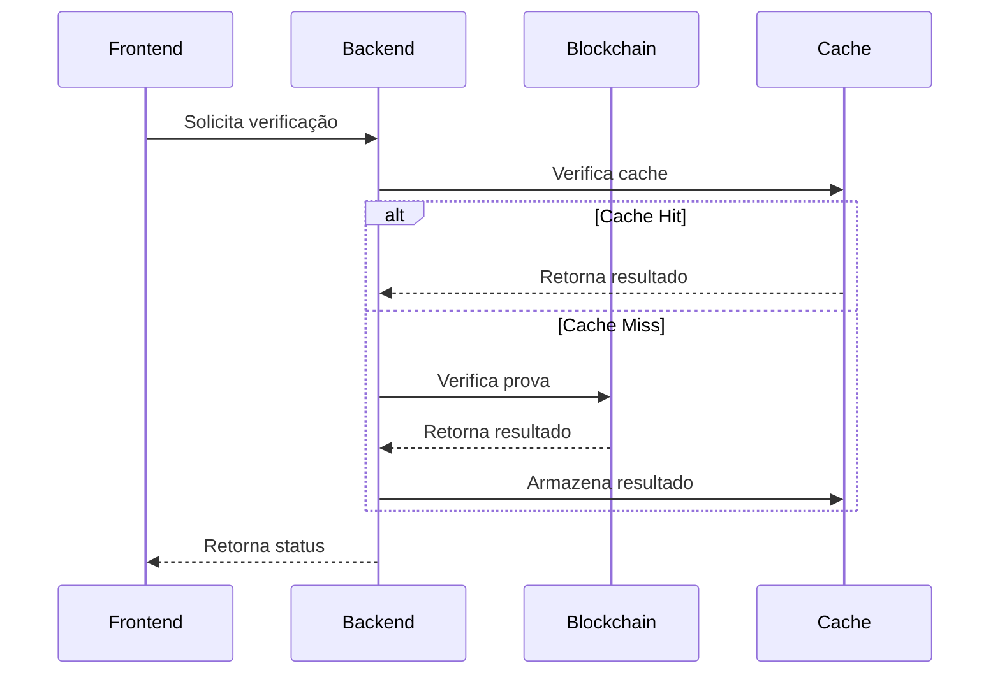

# Integração de Componentes - Ibelieve Finance

## 1. Visão Geral

Este documento descreve a integração entre os diferentes componentes do Ibelieve Finance, incluindo fluxos de dados, comunicação entre serviços e padrões de integração.

## 2. Fluxo de Dados

### 2.1 Geração de Prova



### 2.2 Verificação de Prova



## 3. Integração Frontend-Backend

### 3.1 API REST

```typescript
// frontend/src/services/api.ts
import axios from 'axios';

const api = axios.create({
    baseURL: process.env.REACT_APP_API_URL,
    headers: {
        'Content-Type': 'application/json'
    }
});

export const proofService = {
    generateProof: async (data: ProofRequest) => {
        const response = await api.post('/proofs/generate', data);
        return response.data;
    },

    verifyProof: async (proofId: string) => {
        const response = await api.get(`/proofs/${proofId}/verify`);
        return response.data;
    },

    listProofs: async (params: ListParams) => {
        const response = await api.get('/proofs', { params });
        return response.data;
    }
};
```

### 3.2 WebSocket

```typescript
// frontend/src/services/websocket.ts
import { io } from 'socket.io-client';

const socket = io(process.env.REACT_APP_WS_URL);

export const websocketService = {
    connect: () => {
        socket.connect();
    },

    disconnect: () => {
        socket.disconnect();
    },

    onProofStatus: (callback: (data: ProofStatus) => void) => {
        socket.on('proof:status', callback);
    },

    onTokenTransfer: (callback: (data: TokenTransfer) => void) => {
        socket.on('token:transfer', callback);
    }
};
```

## 4. Integração Backend-Blockchain

### 4.1 Serviço de Prova

```typescript
// backend/src/services/proof.service.ts
import { ethers } from 'ethers';
import { SolvencyVerifier } from '../contracts/SolvencyVerifier';
import { ProofManager } from '../contracts/ProofManager';
import { generateProof } from '../utils/circuit';

export class ProofService {
    private verifier: ethers.Contract;
    private proofManager: ethers.Contract;
    private provider: ethers.providers.Provider;

    constructor(provider: ethers.providers.Provider) {
        this.provider = provider;
        this.verifier = new ethers.Contract(
            process.env.VERIFIER_ADDRESS!,
            SolvencyVerifier.abi,
            provider
        );
        this.proofManager = new ethers.Contract(
            process.env.PROOF_MANAGER_ADDRESS!,
            ProofManager.abi,
            provider
        );
    }

    async generateAndSubmitProof(data: ProofData): Promise<ProofResult> {
        // Gera prova zk-SNARK
        const proof = await generateProof(data);

        // Submete prova na blockchain
        const tx = await this.proofManager.submitProof(
            proof.proofHash,
            data.balance,
            data.timestamp
        );

        const receipt = await tx.wait();
        return {
            proofHash: proof.proofHash,
            txHash: receipt.transactionHash,
            status: 'submitted'
        };
    }

    async verifyProof(proofHash: string): Promise<boolean> {
        const proof = await this.proofManager.getProof(proofHash);
        return proof.verified;
    }
}
```

### 4.2 Serviço de Cache

```typescript
// backend/src/services/cache.service.ts
import Redis from 'ioredis';

export class CacheService {
    private redis: Redis;

    constructor() {
        this.redis = new Redis(process.env.REDIS_URL);
    }

    async getProofStatus(proofHash: string): Promise<ProofStatus | null> {
        const data = await this.redis.get(`proof:${proofHash}`);
        return data ? JSON.parse(data) : null;
    }

    async setProofStatus(proofHash: string, status: ProofStatus): Promise<void> {
        await this.redis.set(
            `proof:${proofHash}`,
            JSON.stringify(status),
            'EX',
            3600 // 1 hora
        );
    }

    async invalidateProof(proofHash: string): Promise<void> {
        await this.redis.del(`proof:${proofHash}`);
    }
}
```

### 4.3 Serviço de Eventos

```typescript
// backend/src/services/event.service.ts
import { ethers } from 'ethers';
import { ProofManager } from '../contracts/ProofManager';
import { CacheService } from './cache.service';
import { WebSocketService } from './websocket.service';

export class EventService {
    private proofManager: ethers.Contract;
    private cache: CacheService;
    private ws: WebSocketService;

    constructor(
        provider: ethers.providers.Provider,
        cache: CacheService,
        ws: WebSocketService
    ) {
        this.proofManager = new ethers.Contract(
            process.env.PROOF_MANAGER_ADDRESS!,
            ProofManager.abi,
            provider
        );
        this.cache = cache;
        this.ws = ws;
    }

    async startListening(): Promise<void> {
        this.proofManager.on('ProofSubmitted', async (proofHash, user, balance, timestamp) => {
            const status = {
                proofHash,
                user,
                balance,
                timestamp,
                status: 'submitted'
            };

            await this.cache.setProofStatus(proofHash, status);
            this.ws.broadcast('proof:status', status);
        });

        this.proofManager.on('ProofVerified', async (proofHash, success) => {
            const status = await this.cache.getProofStatus(proofHash);
            if (status) {
                status.status = success ? 'verified' : 'rejected';
                await this.cache.setProofStatus(proofHash, status);
                this.ws.broadcast('proof:status', status);
            }
        });
    }
}
```

## 5. Integração com Serviços Externos

### 5.1 Serviço de Notificação

```typescript
// backend/src/services/notification.service.ts
import { WebSocketService } from './websocket.service';
import { EmailService } from './email.service';

export class NotificationService {
    constructor(
        private ws: WebSocketService,
        private email: EmailService
    ) {}

    async notifyProofStatus(proof: ProofStatus): Promise<void> {
        // Notifica via WebSocket
        this.ws.broadcast('proof:status', proof);

        // Envia email se necessário
        if (proof.status === 'verified') {
            await this.email.sendProofVerified(proof);
        }
    }
}
```

### 5.2 Serviço de Monitoramento

```typescript
// backend/src/services/monitoring.service.ts
import { MetricsService } from './metrics.service';
import { LoggingService } from './logging.service';

export class MonitoringService {
    constructor(
        private metrics: MetricsService,
        private logging: LoggingService
    ) {}

    async trackProofGeneration(proof: ProofData): Promise<void> {
        this.metrics.increment('proof.generation.attempt');
        this.logging.info('Proof generation attempt', { proof });
    }

    async trackProofVerification(proof: ProofStatus): Promise<void> {
        this.metrics.increment(`proof.verification.${proof.status}`);
        this.logging.info('Proof verification result', { proof });
    }
}
```

## 6. Tratamento de Erros

### 6.1 Middleware de Erro

```typescript
// backend/src/middleware/error.middleware.ts
import { Request, Response, NextFunction } from 'express';
import { LoggingService } from '../services/logging.service';

export class ErrorHandler {
    constructor(private logging: LoggingService) {}

    handle = (err: Error, req: Request, res: Response, next: NextFunction) => {
        this.logging.error('Error occurred', {
            error: err.message,
            stack: err.stack,
            path: req.path,
            method: req.method
        });

        if (err instanceof ValidationError) {
            return res.status(400).json({
                error: 'Validation Error',
                details: err.details
            });
        }

        if (err instanceof BlockchainError) {
            return res.status(503).json({
                error: 'Blockchain Error',
                details: err.details
            });
        }

        return res.status(500).json({
            error: 'Internal Server Error'
        });
    };
}
```

### 6.2 Retry Strategy

```typescript
// backend/src/utils/retry.ts
import { ethers } from 'ethers';

export async function withRetry<T>(
    operation: () => Promise<T>,
    maxRetries: number = 3,
    delay: number = 1000
): Promise<T> {
    let lastError: Error;
    
    for (let i = 0; i < maxRetries; i++) {
        try {
            return await operation();
        } catch (error) {
            lastError = error;
            
            if (error instanceof ethers.providers.ProviderError) {
                await new Promise(resolve => setTimeout(resolve, delay * Math.pow(2, i)));
                continue;
            }
            
            throw error;
        }
    }
    
    throw lastError!;
}
```

## 7. Referências

- [Ethers.js Documentation](https://docs.ethers.io)
- [Socket.IO Documentation](https://socket.io/docs)
- [Redis Documentation](https://redis.io/documentation)
- [Express.js Documentation](https://expressjs.com) 